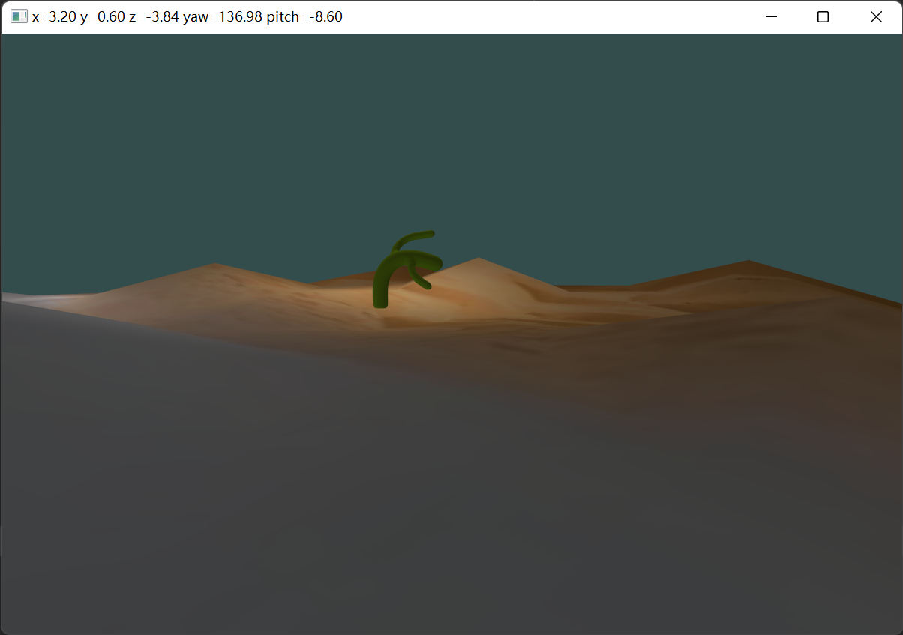
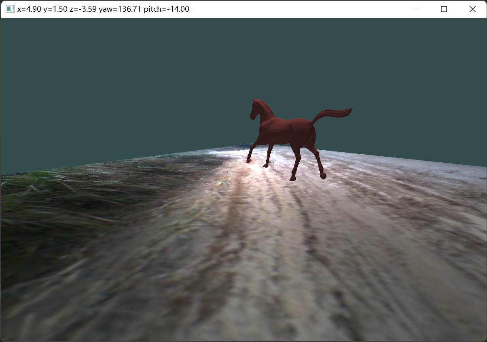
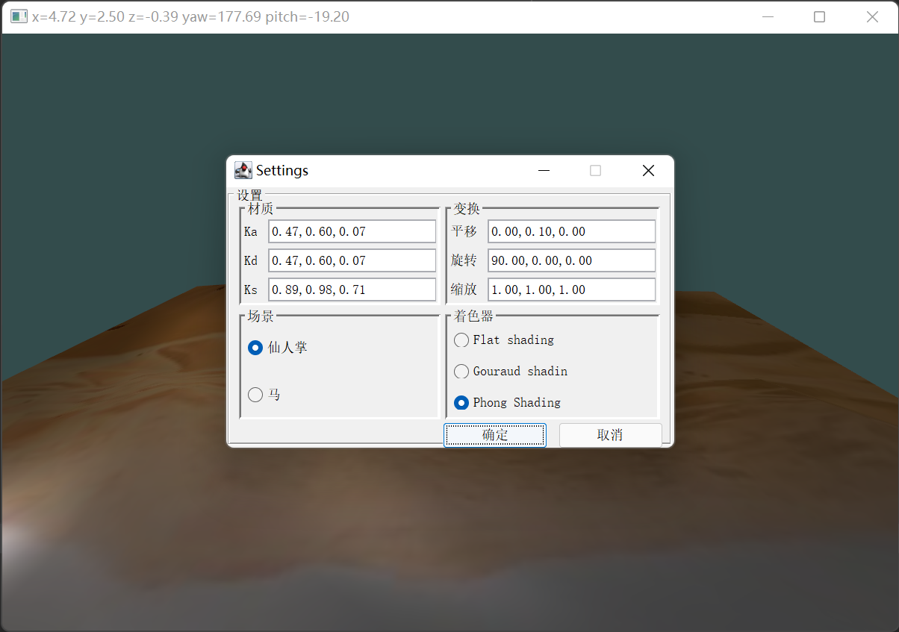

# Animation-LWJGL

This repository is my homework in computer graphics course, which build an animation using a sequence of model. The project consists of two animations with different background. In addition, I make an interactive edit menu by Swing, so you can  modify geometric transformation in time. I hope these can  help those who are learning [LWJGL](https://www.lwjgl.org/).

## Platform

- Windows x64
- MacOS arm64

## Overview of technology

LWJGL is a Java library that enables cross-platform access to OpenGL (Vulkan is also supported, but only OpenGL is used here). Although the graphics card cannot directly access the memory allocated by the JVM virtual machine, we can directly apply for "native memory" to communicate with the graphics card through `ByteBuffer`. Besides, accessing the API of OpenGL through Java is almost the same as using `glad` in C++.

In order to refresh the picture at a constant frame rate, we use vertical synchronization technology.

LWJGL provides Java binding of `assimp`. We use [assimp](https://github.com/assimp/assimp) to read the model file.

The interactive menu does not use OpenGL to draw the hub, but simply calls swing to complete the drawing. thread managed by LWJGL and Swing transaction thread use Java's built-in lock (`synchronized` keyword) to synchronize.

## Screenshot

- `W`, `S`, `A`, `D` to move
- mouse movement to control perspective
- `left mouse button` to capture / release cursor
- `M` to show settings
- `ESC` to release cursor

## License

**ATTENTION: For ease of use, this repository also packs animation model file(*.obj). Those resource are for learning only. Please pay attention to its copyright.**

***

**MIT License**

Copyright (c) 2022 ColorsWind

Permission is hereby granted, free of charge, to any person obtaining a copy of this software and associated documentation files (the  "Software"), to deal in the Software without restriction, including  without limitation the rights to use, copy, modify, merge, publish,  distribute, sublicense, and/or sell copies of the Software, and to  permit persons to whom the Software is furnished to do so, subject to  the following conditions:

The above copyright notice and this permission notice shall be included in all copies or substantial portions of the Software.

THE SOFTWARE IS PROVIDED "AS IS", WITHOUT WARRANTY OF ANY KIND,  EXPRESS OR IMPLIED, INCLUDING BUT NOT LIMITED TO THE WARRANTIES OF  MERCHANTABILITY, FITNESS FOR A PARTICULAR PURPOSE AND NONINFRINGEMENT.  IN NO EVENT SHALL THE AUTHORS OR COPYRIGHT HOLDERS BE LIABLE FOR ANY  CLAIM, DAMAGES OR OTHER LIABILITY, WHETHER IN AN ACTION OF CONTRACT,  TORT OR OTHERWISE, ARISING FROM, OUT OF OR IN CONNECTION WITH THE  SOFTWARE OR THE USE OR OTHER DEALINGS IN THE SOFTWARE.

## Acknowledgment

The  [LWJGL Book](https://github.com/lwjglgamedev/lwjglbook)([CN](https://mouse0w0.github.io/lwjglbook-CN-Translation/)) tutorial has brought me great help to this project. Some of the codes refer to the reference codes provided by the author.
